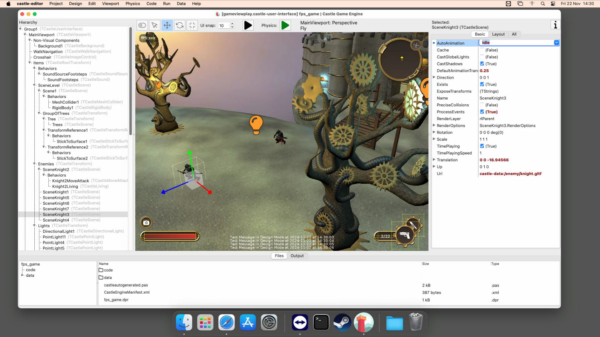
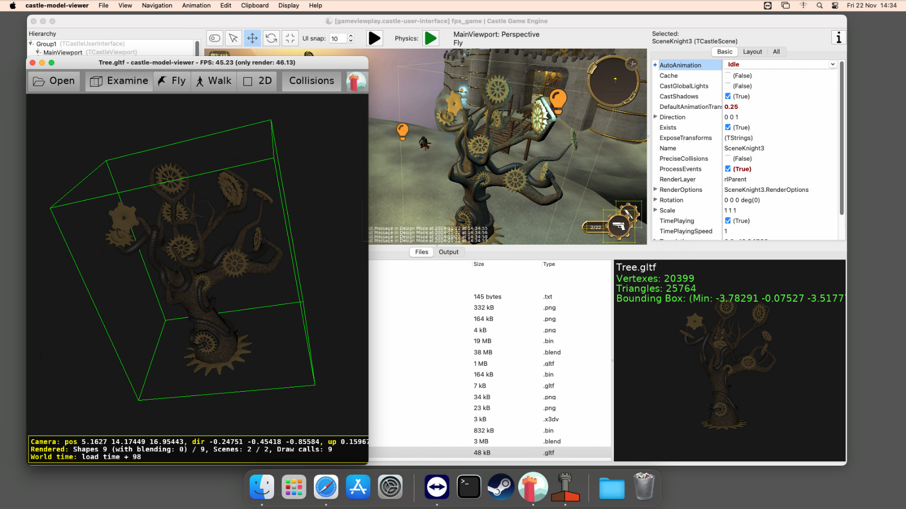
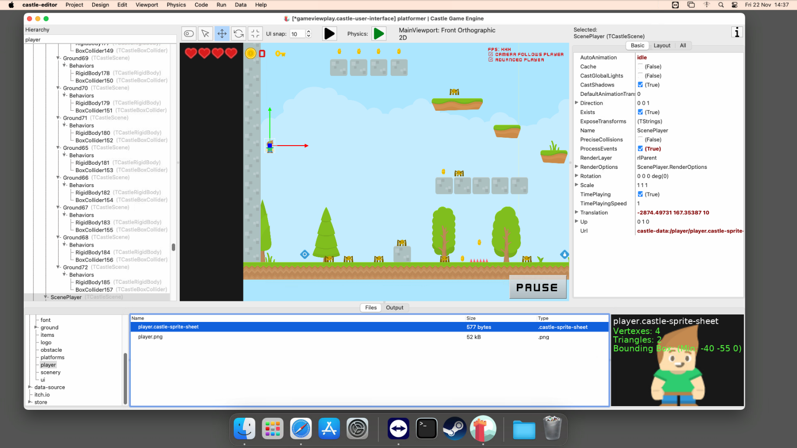
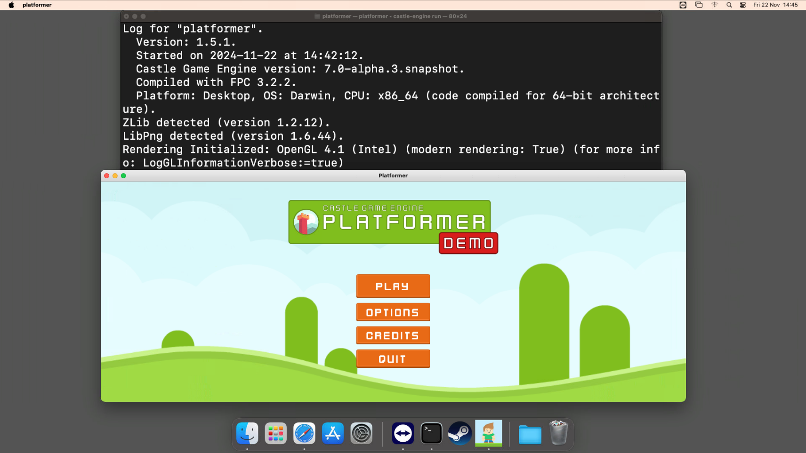

# Castle Game Engine and MacStadium

## About Castle Game Engine

[Castle Game Engine](https://castle-engine.io/) is an open-source cross-platform game engine. You design 3D and 2D games using our [visual editor](https://castle-engine.io/editor) and write code using [modern Object Pascal](https://castle-engine.io/why_pascal) -- a clean, efficient, and modern (classes, units, generics) programming language.

We support a number of platforms -- desktop (Linux, Windows, macOS, FreeBSD), mobile (Android, iOS), consoles (Nintendo Switch). We pride ourselves that you can not only _target_ multiple platforms (that is, make a single application source code and just recompile for multiple platforms) but also _work on_ multiple platforms. That is, our editor and compiler also work on multiple platforms, so you can design your games on any desktop system we support. We plan to add more, in particular [web platform is in active development](https://castle-engine.io/web).

We also cooperate with a number of graphic standards (X3D, glTF, IFC...), which in turn means cooperation with various 3D authoring tools (Blender, 3ds Max, Maya...) and various asset stores (like [Sketchfab](https://castle-engine.io/sketchfab)).

We also feature a number of tools, for example [Castle Model Viewer](https://castle-engine.io/castle-model-viewer), a viewer for 3D and 2D model formats supported by the engine. This model viewer is a useful tool also independently of the game engine.

For more information, head to the [engine webpage](https://castle-engine.io/), [downloads](https://castle-engine.io/download), [read the detailed list of features](https://castle-engine.io/features), [read tutorial](https://castle-engine.io/bad_chess), [watch video tutorial](https://www.youtube.com/watch?v=xvAmuPD4PrU) and finally take a look at [macOS specific information](https://castle-engine.io/macos).

## Using MacStadium for Castle Game Engine development

### GitHub Actions runner

First of all, we're big fans of _continuous integration and delivery_. We recommend developers to use solutions like [GitHub Actions](https://castle-engine.io/github_actions), [GitLab CI/CD](https://castle-engine.io/gitlab_ci), [Jenkins](https://castle-engine.io/jenkins) and we provide ready recipes for them. The engine itself is [hosted on GitHub](https://github.com/castle-engine/castle-engine/) and is using now GitHub actions to perform a number of automatic tests and then build the resulting engine.

Thanks to MacStadium, we have a persistent, fully under our control, macOS environment where all these jobs run. We have a set of tools installed there, including a number of packages from [HomeBrew](https://brew.sh/) and the open-soruce FPC compiler (using [FpcUpDeluxe](https://castle-engine.io/fpcupdeluxe)).

We have also migrated a few months ago from [Jenkins](https://www.jenkins.io/) to [GitHub Actions](https://docs.github.com/en/actions), migrating also the MacStadium machine from a _Jenkins node_ to a _GitHub Actions runner_. This was an easy transition, again thanks to us having a full control over the machine.

We use Intel-based macOS machine now and are happy that MacStadium gives us an option to switch to an 64-bit ARM architecture (commonly known as _Apple Silicon_ within the Apple ecosystem) when we will want to. Our engine and compiler can target both Intel and ARM architectures.

### Interactively testing on macOS

A second use-case arises from the fact that not all _Castle Game Engine_ developers have their own macOS machines to test. And even when we do, some of the Apple hardware we have is old. MacStadium allows to avoid this limitation -- we just have access to a shared machine, with the Apple OS that we want, on the Apple hardware (real or virtual) that we want.

This is tremendously useful when testing and investigating macOS-specific issues. While we have a set of auto-tests that run non-interactively, from command-line, but many of the important engine code really comes into play once you run the editor and click around or run our [Castle Model Viewer](https://castle-engine.io/castle-model-viewer). Our editor uses Apple Cocoa framework (through [Lazarus](https://www.lazarus-ide.org/)) while the games using our engine use Cocoa through our custom integration code. So there's a bit of macOS-specific code that we need to test.

Moreover, on macOS our engine can build ready [application bundles](https://castle-engine.io/macos#_macos_application_bundles). These are implemented in our [build tool](https://castle-engine.io/build_tool) and also require testing specifically on macOS.

We could also test [new Steam integration](https://castle-engine.io/steam) on macOS this way.

## License and Support

The entire engine is [open-source](https://castle-engine.io/license), with all the features and all the tools. You can use it to develop any games or applications, including proprietary (closed source).

We appreciate supporting the engine on [Patreon](https://www.patreon.com/castleengine). We're also open to cooperate with companies on support and features, see https://castle-engine.io/donate .

## More Screenshots

